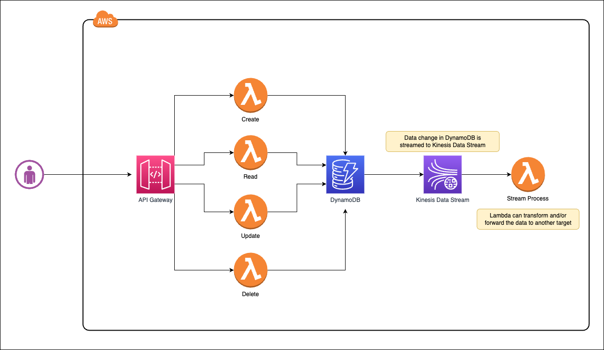

# DynamoDB Streams to capture data change in Amazon DynamoDB by CRUD with REST API in Amazon API Gateway

CDK example of:

- Using CDK multiple stacks to build a simple CRUD application
- REST API in Amazon API Gateway to create, read, update and delete data in Amazon DynamoDB
- Amazon DynamoDB Streams to capture data change in Amazon DynamoDB

Final architecture:

Extra resources:

- [Change data capture for DynamoDB Streams](https://docs.aws.amazon.com/amazondynamodb/latest/developerguide/Streams.html)
- [Deliver DynamoDB records to Amazon S3 using Kinesis Data Streams and Kinesis Data Firehose with AWS CDK](https://docs.aws.amazon.com/prescriptive-guidance/latest/patterns/deliver-dynamodb-records-to-amazon-s3-using-kinesis-data-streams-and-kinesis-data-firehose-with-aws-cdk.html)
- [How to Stream Data from Amazon DynamoDB to Amazon Aurora using AWS Lambda and Amazon Kinesis Firehose](https://aws.amazon.com/blogs/database/how-to-stream-data-from-amazon-dynamodb-to-amazon-aurora-using-aws-lambda-and-amazon-kinesis-firehose/)
